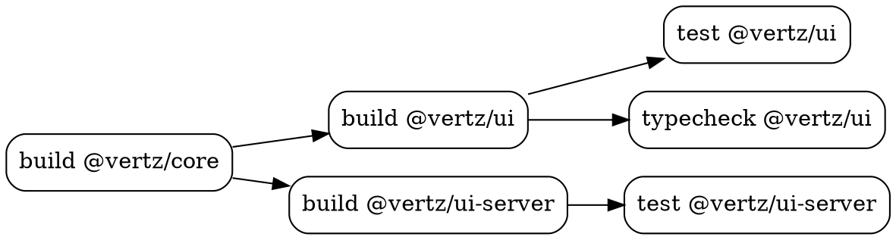

# Phase 6: S3/R2 Remote Cache + CLI Polish

## Context

Phases 1-5 deliver a complete CI runner with local caching and GitHub Actions cache. This phase adds S3/R2 as an alternative remote cache backend (for non-GitHub-Actions CI or self-hosted runners), polishes the CLI with `--json` output mode, `vtz ci graph --dot` visualization, and formal cache manifest documentation. This is the final phase.

Design doc: `plans/pipe-ci-runner.md`

Depends on: Phase 4 (CacheBackend trait, LayeredCache pattern)

## Tasks

### Task 1: S3/R2 remote cache backend

**Files:**
- `native/vtz/Cargo.toml` (modified — add `services-s3` feature to opendal)
- `native/vtz/src/ci/cache.rs` (modified — add S3Cache)

**What to implement:**

**Add OpenDAL S3 feature:**
```toml
opendal = { version = "0.50", features = ["services-ghac", "services-s3"] }
```

**`S3Cache` implements `CacheBackend`:**
```rust
pub struct S3Cache {
    operator: opendal::Operator,
    prefix: String,
}

impl S3Cache {
    /// Create from URL: "s3://bucket/prefix" or "r2://bucket/prefix"
    pub fn from_url(url: &str) -> Result<Self> {
        let (scheme, bucket, prefix) = parse_cache_url(url)?;

        let builder = match scheme {
            "s3" => {
                opendal::services::S3::default()
                    .bucket(&bucket)
                    .region(&std::env::var("AWS_REGION").unwrap_or("us-east-1".into()))
                    // Credentials from standard AWS env vars:
                    // AWS_ACCESS_KEY_ID, AWS_SECRET_ACCESS_KEY, AWS_SESSION_TOKEN
            }
            "r2" => {
                // Cloudflare R2 is S3-compatible
                opendal::services::S3::default()
                    .bucket(&bucket)
                    .endpoint(&std::env::var("R2_ENDPOINT")
                        .unwrap_or_else(|_| format!("https://{}.r2.cloudflarestorage.com",
                            std::env::var("CF_ACCOUNT_ID").unwrap_or_default())))
                    // Credentials: R2_ACCESS_KEY_ID, R2_SECRET_ACCESS_KEY
                    // or standard AWS env vars
            }
            _ => return Err(anyhow!("unsupported cache URL scheme: {scheme}")),
        };

        let operator = opendal::Operator::new(builder)?.finish();
        Ok(Self { operator, prefix })
    }
}
```

**Wire into `create_cache_backend()`:**
```rust
Some(RemoteCacheConfig::Url(url)) => {
    let remote = S3Cache::from_url(url)?;
    Box::new(LayeredCache { remote, local: LocalCache::new(config) })
}
```

**Config example:**
```typescript
cache: {
  remote: 's3://my-ci-cache/vertz',
  // or: 'r2://my-ci-cache/vertz'
}
```

**Acceptance criteria:**
- [ ] `S3Cache::from_url("s3://bucket/prefix")` creates S3 operator
- [ ] `S3Cache::from_url("r2://bucket/prefix")` creates R2-compatible operator
- [ ] `get()` reads from S3 with fallback key support
- [ ] `put()` writes to S3
- [ ] Credentials from standard AWS/R2 env vars
- [ ] Invalid URL scheme produces clear error
- [ ] `create_cache_backend()` routes S3/R2 URLs correctly
- [ ] `LayeredCache` works with S3 as remote backend
- [ ] `cargo test --all` passes
- [ ] `cargo clippy --all-targets --release -- -D warnings` passes

---

### Task 2: `--json` output mode

**Files:**
- `native/vtz/src/ci/output.rs` (modified — add JSON output)
- `native/vtz/src/ci/mod.rs` (modified — wire `--json` flag)

**What to implement:**

When `--json` flag is set, suppress all human-readable output and emit structured JSON to stdout.

**JSON output format:**
```json
{
  "run_id": "01JQXYZ...",
  "duration_ms": 12400,
  "status": "success",
  "workspace": {
    "packages": 28,
    "native_crates": 3
  },
  "changes": {
    "files": 4,
    "packages_affected": ["@vertz/ui", "@vertz/ui-server"],
    "packages_transitive": ["@vertz/ui-primitives"]
  },
  "tasks": [
    {
      "name": "build",
      "package": "@vertz/ui",
      "status": "success",
      "cached": false,
      "duration_ms": 1800,
      "exit_code": 0
    },
    {
      "name": "lint",
      "package": null,
      "status": "success",
      "cached": false,
      "duration_ms": 2100,
      "exit_code": 0
    }
  ],
  "summary": {
    "total": 14,
    "executed": 8,
    "cached": 3,
    "skipped": 3,
    "failed": 0,
    "cache_time_saved_ms": 4200
  }
}
```

This enables machine consumption: `vtz ci ci --json > results.json` or piping to `jq`.

**Acceptance criteria:**
- [ ] `--json` suppresses all human-readable output
- [ ] JSON output includes run_id, duration, status
- [ ] JSON output includes per-task results with name, package, status, cached, duration
- [ ] JSON output includes summary with counts
- [ ] JSON output includes workspace and change detection info
- [ ] Output is valid JSON (parseable by `jq`)
- [ ] Secret values redacted in JSON output
- [ ] `cargo test --all` passes
- [ ] `cargo clippy --all-targets --release -- -D warnings` passes

---

### Task 3: `vtz ci graph` visualization + `cache push`

**Files:**
- `native/vtz/src/ci/graph.rs` (modified — add DOT output)
- `native/vtz/src/ci/cache.rs` (modified — add push command)
- `native/vtz/src/ci/mod.rs` (modified — wire commands)

**What to implement:**

**`vtz ci graph`** — print the task execution graph:

Default (text):
```
build (@vertz/core) →
  build (@vertz/ui) →
    test (@vertz/ui)
    typecheck (@vertz/ui)
  build (@vertz/ui-server) →
    test (@vertz/ui-server)
lint
rust-checks
```

**`vtz ci graph --dot`** — Graphviz DOT format:


Users can pipe to `dot -Tpng -o graph.png` for visual graphs.

**`vtz ci cache push`** — push local cache entries to remote:
- Iterate all local cache entries
- For each, check if it exists in remote (`cache.exists()`)
- If not, upload (`cache.put()`)
- Progress bar showing upload progress
- Summary: `Pushed 12 entries (234 MB) to remote cache`

Useful for pre-warming CI caches from a developer's local machine.

**Acceptance criteria:**
- [ ] `vtz ci graph` prints human-readable task dependency tree
- [ ] `vtz ci graph --dot` outputs valid Graphviz DOT format
- [ ] Graph includes edge labels for non-default edge types
- [ ] `vtz ci cache push` uploads local entries missing from remote
- [ ] `vtz ci cache push` shows progress and summary
- [ ] `vtz ci cache push` skips entries already in remote
- [ ] `cargo test --all` passes
- [ ] `cargo clippy --all-targets --release -- -D warnings` passes
