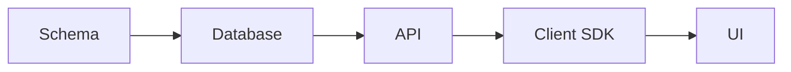

# @vertz/docs — Full-Stack Documentation Framework

> A documentation framework built on Vertz that replaces Mintlify, ships as a reusable package, deploys to Cloudflare, and auto-generates LLM-friendly output.

## Status

**Draft — Rev 2** — Addresses DX, Product, and Technical review findings from Rev 1.

**Issue:** TBD

## Changes from Rev 1

| Finding | Resolution |
|---------|-----------|
| Config filename `docs.config.ts` breaks convention | Changed to `vertz.config.ts` with `type: 'docs'` — same config file as all Vertz projects |
| Sidebar page refs as bare strings without codegen | Explicit `.mdx` extensions required. Build-time validation in `vertz docs check`, not type-level codegen |
| MDX not integrated into Bun dev server plugin pipeline | Added Phase 0.5: MDX+Vertz composite plugin as prerequisite |
| SSG build pipeline doesn't exist for docs | Added SSG Architecture section specifying the build pipeline |
| Scope too large (8 phases) | Cut to 7 phases. Removed: versioning, page feedback, page modes, programmatic API, component docs plugin |
| Reusable package angle premature | Kept as package but minimal API surface. No `createDocsApp()` in v1 |
| LLM output not a real differentiator | Strengthened with semantic chunking, structured metadata, and component-to-markdown mapping table |
| Migration risk unaddressed | Added Migration Strategy section |
| Redirect `from/to` diverges from convention | Changed to `source/destination` matching Mintlify/Vercel |
| `head` accepts raw HTML strings | Changed to typed objects + named analytics integrations |
| `_llm/` vs `/llm/` URL mismatch | Unified to `llm/` everywhere |
| CLI as separate binary vs extending `@vertz/cli` | Changed to `vertz docs <command>` subcommand |
| Mermaid rendering unspecified | Build-time via rehype plugin, optional peer dependency |
| Global MDX components under-specified | Specified: components map via `@mdx-js/mdx` components prop at render time |
| Shiki dual-theme contradictory | Extend `@vertz/mdx` to support dual themes at compile time via CSS variables |
| No init/scaffolding command | Added `vertz docs init` |
| Banner markdown-in-string | Changed to structured object format |
| LLM MDX-to-markdown complexity | Added component-to-markdown mapping table. Dual remark pass for markdown output |
| Phase ordering | LLM output moved before search |
| Blog scope ambiguous | Added as non-goal |
| Custom components in Phase 1 structure but not supported | Removed from file structure until Phase 2 |
| Timing conflicts with core roadmap | Acknowledged — user has chosen this as a priority |
| Versioning via directory duplication | Cut from v1 entirely |

## Motivation

Vertz currently uses Mintlify for API/guide documentation (`packages/docs/`) and a custom Vertz app for component docs (`sites/component-docs/`). This creates three problems:

1. **Split identity** — The framework that preaches "one stack" outsources its own docs to a third-party SaaS product. We can't add Vertz-specific components (live component previews, compiler playgrounds, interactive schema explorers) without hacking around Mintlify's closed component system.

2. **Dogfooding gap** — A docs framework is a perfect stress test for Vertz: SSR, routing, MDX, theming, SSG, Cloudflare deployment. Building it reveals real framework gaps that synthetic examples miss. It also becomes a showcase — every open-source project needs docs, and `@vertz/docs` proves Vertz works for real products.

3. **LLM-native content delivery** — Current doc frameworks treat LLM output as an afterthought (Mintlify's `llms.txt` is a recent bolt-on). Vertz can do better: semantically chunked content, structured API metadata extracted from TypeScript source, and code examples tagged with runnability and expected output — so an LLM can both find the right answer AND verify its own generated code.

## Manifesto Alignment

| Principle | How this design aligns |
|-----------|----------------------|
| **If it builds, it works** | Config is typed via `defineDocsConfig()`. Sidebar page references validated at build time. Broken links caught by `vertz docs check`. |
| **One way to do things** | One config file (`vertz.config.ts`), one set of MDX components, one CLI (`vertz docs`). No "bring your own router." |
| **AI agents are first-class users** | LLM output is dual-compiled from the same MDX source. Semantic chunking, structured metadata, and runnable code tags are built into the pipeline. |
| **If you can't demo it, it's not done** | The Vertz docs site *is* the demo. Dogfooding from day one. |
| **Performance is not optional** | SSG by default. Pre-rendered HTML + Cloudflare CDN. Build-time Shiki highlighting. No client JS for code blocks. |
| **No ceilings** | Mintlify is a ceiling — we can't add features they don't support, can't control the build pipeline, can't add Vertz-native interactive components. Owning the docs framework removes that ceiling. |

### What we rejected

- **Docusaurus/Nextra** — React-based, heavy, not Vertz. Using another framework to document our framework undermines the "one stack" message and teaches us nothing about Vertz's capabilities.
- **Starlight (Astro)** — Good product, but still another framework with its own component model, routing, and build pipeline.
- **Keep Mintlify + extend** — Mintlify's component set is closed. We can't add `<ComponentPreview>` (live Vertz component rendering), `<CompilerPlayground>` (interactive compiler output viewer), or any Vertz-native interactive component.
- **Build as app first, extract later** — Considered (Product reviewer suggested this). Decided to build as a minimal package from the start because the package boundary forces clean API design and the config system is reusable from day one. The API surface is intentionally minimal — no `createDocsApp()`, no plugin system in v1.

## Non-Goals

- **WYSIWYG editor / dashboard** — Content is authored in MDX files in a git repo. No web editor.
- **AI chatbot** — We'll serve LLM-friendly content but won't build an embedded chatbot.
- **Multi-language i18n** — Not in v1. File-based routing makes it structurally possible later.
- **Authentication / gated content** — Docs are public. Enterprise gating is out of scope.
- **API playground with live requests** — OpenAPI rendering yes, interactive playground no.
- **PDF export** — Out of scope.
- **Analytics dashboard** — We support injecting analytics scripts, but no first-party analytics.
- **Versioning** — Pre-v1, there's only one version. Versioning adds complexity for a future problem. Can be designed when Vertz reaches v1.
- **Page feedback (thumbs up/down)** — Requires backend. Not a docs framework concern.
- **Programmatic API (`createDocsApp()`)** — No demonstrated use case. Escape hatch deferred until someone needs it.
- **Blog engine** — Footer links may reference external blog URLs, but the docs framework doesn't include a blog system.
- **Component docs plugin** — The existing `sites/component-docs/` works. Migrating it to `@vertz/docs` is a separate future project, not a phase here.

## API Surface

### 1. Config — `vertz.config.ts`

Uses the standard Vertz config file with `type: 'docs'`, following the same pattern as `type: 'app'` and `type: 'api'`.

```ts
import { defineDocsConfig } from '@vertz/docs';

export default defineDocsConfig({
  name: 'Vertz',
  logo: {
    light: '/logo/light.svg',
    dark: '/logo/dark.svg',
  },
  favicon: '/favicon.svg',

  theme: {
    palette: 'zinc',
    radius: 'md',
    colors: {
      primary: '#3b82f6',
      light: '#60a5fa',
      dark: '#2563eb',
    },
    appearance: 'system', // 'light' | 'dark' | 'system'
    codeTheme: {
      light: 'github-light',
      dark: 'github-dark',
    },
    fonts: {
      heading: 'Geist',
      body: 'Geist',
      mono: 'Geist Mono',
    },
  },

  navbar: {
    links: [
      { label: 'GitHub', href: 'https://github.com/vertz-dev/vertz', icon: 'github' },
    ],
    cta: { label: 'Get Started', href: '/quickstart' },
  },

  footer: {
    socials: {
      github: 'https://github.com/vertz-dev/vertz',
      x: 'https://x.com/veraborgesv',
    },
    links: [
      {
        title: 'Resources',
        items: [
          { label: 'Blog', href: 'https://blog.vertz.dev' },
        ],
      },
    ],
  },

  sidebar: [
    {
      tab: 'Guides',
      groups: [
        {
          title: 'Getting Started',
          pages: ['index.mdx', 'quickstart.mdx', 'installation.mdx'],
        },
        {
          title: 'vertz/ui',
          icon: 'desktop',
          expanded: true,
          pages: [
            'guides/ui/overview.mdx',
            'guides/ui/components.mdx',
            'guides/ui/reactivity.mdx',
          ],
        },
      ],
    },
    {
      tab: 'API Reference',
      groups: [
        {
          title: 'vertz/ui',
          pages: ['api-reference/ui/reactivity.mdx', 'api-reference/ui/css.mdx'],
        },
      ],
    },
  ],

  search: {
    placeholder: 'Search docs...',
  },

  seo: {
    siteName: 'Vertz Documentation',
    ogImage: '/og-default.png',
    twitterHandle: '@veraborgesv',
  },

  redirects: [
    { source: '/guides/getting-started', destination: '/quickstart' },
  ],

  llm: {
    enabled: true,
    title: 'Vertz Framework Documentation',
    description: 'Full-stack TypeScript framework — schema to browser.',
    exclude: ['changelog/**'],
  },

  banner: {
    text: 'Vertz v0.1 is out!',
    link: { label: 'Read the announcement', href: 'https://blog.vertz.dev/v01' },
    dismissible: true,
  },

  head: [
    { tag: 'script', attrs: { defer: true, 'data-domain': 'vertz.dev', src: 'https://plausible.io/js/script.js' } },
  ],

  analytics: {
    plausible: { domain: 'vertz.dev' },
    // Also supports: ga4: { measurementId: 'G-XXX' }, posthog: { apiKey: '...' }
  },
});
```

#### Design decisions

- **`vertz.config.ts` not `docs.config.ts`** — Users already know `vertz.config.ts` is where config lives. A docs project is still a Vertz project. `defineDocsConfig()` provides the docs-specific type narrowing.
- **Explicit `.mdx` extensions in sidebar** — `'quickstart.mdx'` not `'quickstart'`. Explicit over implicit (per manifesto). No mental mapping needed. All paths are relative to `pages/`.
- **Build-time page validation, not type-level codegen** — `vertz docs check` validates that every sidebar reference resolves to an actual file. Type-level validation via codegen can be added later but is not in v1. The tradeoff: you don't get red squiggles for typos in sidebar strings until you run `check`, but you also don't need a codegen step.
- **`source/destination` for redirects** — Matches Mintlify and Vercel convention. Migration from Mintlify `docs.json` is mechanical.
- **Typed `head` objects** — `{ tag, attrs }` instead of raw HTML strings. The type system verifies structure. No XSS vector from string interpolation.
- **Banner as structured object** — `{ text, link }` instead of markdown-in-a-string. Unambiguous, typechecked.
- **No `search.shortcut` option** — Cmd+K / Ctrl+K is the universal standard. Hardcoded. One way to do things.

### 2. Page authoring — MDX files

```
my-docs/
├── vertz.config.ts
├── pages/
│   ├── index.mdx
│   ├── quickstart.mdx
│   ├── guides/
│   │   └── ui/
│   │       ├── overview.mdx
│   │       └── components.mdx
│   └── api-reference/
│       └── ui/
│           └── reactivity.mdx
├── snippets/
│   └── install-command.mdx
└── public/
    ├── logo/
    │   ├── light.svg
    │   └── dark.svg
    └── favicon.svg
```

Note: `components/` directory for custom MDX components is supported from Phase 2 onwards (when MDX components are wired in). Custom components use standard MDX import syntax: `import MyDemo from '../components/my-demo.tsx'`.

#### MDX frontmatter

```mdx
---
title: Data Fetching
description: Load server data with type-safe queries
icon: cloud-arrow-down
sidebarTitle: Data Fetching
keywords: [query, fetch, data, loading]
hidden: false
noindex: false
---

# Data Fetching

Content here uses standard MDX...

<Note>
  The `query()` function auto-disposes when the component unmounts.
</Note>
```

### 3. Built-in MDX components

Every component is available globally in MDX files — no imports needed. This works via `@mdx-js/mdx`'s components map: the compiled MDX function receives a `components` object at render time that maps component names to implementations. The docs renderer passes the full built-in components map automatically.

#### Callouts / Admonitions

```mdx
<Note>Informational context the reader should know.</Note>

<Tip>Helpful suggestion or best practice.</Tip>

<Warning>Something that could cause issues if ignored.</Warning>

<Info>General information callout.</Info>

<Check>Confirmation that something is correct or complete.</Check>

<Danger>Critical warning — data loss, security risk, etc.</Danger>

<Callout icon="lightbulb" color="#8b5cf6">
  Custom callout with any icon and color.
</Callout>
```

Note: `<Warning>` is equivalent to `<Callout type="warning">`. The named components are thin aliases for the generic `<Callout>`. Use named variants when the type matches (Note, Tip, Warning, etc.). Use `<Callout>` only for custom icon/color combinations that don't match any named type.

#### Code blocks

````mdx
```ts title="schema.ts" {3-5} showLineNumbers
import { d } from '@vertz/db';

const users = d.table('users', {
  id: d.uuid().primaryKey(),
  name: d.text().notNull(),
});
```

```diff
- import { createServer } from '@vertz/server';
+ import { createApp } from '@vertz/server';
```
````

#### CodeGroup — tabbed multi-language blocks

````mdx
<CodeGroup>
```ts title="PostgreSQL"
const db = createDb({ dialect: 'postgres', connectionString: '...' });
```

```ts title="SQLite"
const db = createDb({ dialect: 'sqlite', filename: './data.db' });
```
</CodeGroup>
````

#### Steps

```mdx
<Steps>
  <Step title="Install dependencies" icon="download">
    ```bash
    bun add @vertz/server @vertz/db
    ```
  </Step>

  <Step title="Define your schema" icon="database">
    Create a `schema.ts` file...
  </Step>

  <Step title="Run the dev server" icon="rocket">
    ```bash
    bun run dev
    ```
  </Step>
</Steps>
```

#### Tabs

```mdx
<Tabs>
  <Tab title="Bun">
    ```bash
    bun add @vertz/server
    ```
  </Tab>
  <Tab title="npm">
    ```bash
    npm install @vertz/server
    ```
  </Tab>
</Tabs>
```

#### Cards

```mdx
<CardGroup cols={2}>
  <Card title="Quickstart" icon="rocket" href="/quickstart">
    Get up and running in 5 minutes.
  </Card>
  <Card title="API Reference" icon="book" href="/api-reference">
    Full API documentation.
  </Card>
</CardGroup>
```

#### Accordion

```mdx
<Accordion title="What databases does Vertz support?">
  PostgreSQL and SQLite (including Cloudflare D1).
</Accordion>

<AccordionGroup>
  <Accordion title="Question 1">Answer 1</Accordion>
  <Accordion title="Question 2">Answer 2</Accordion>
</AccordionGroup>
```

#### Columns

```mdx
<Columns cols={2}>
  <Column>
    Left column content
  </Column>
  <Column>
    Right column content
  </Column>
</Columns>
```

#### Frame

```mdx
<Frame caption="The Vertz dashboard">
  
</Frame>
```

#### API Documentation

```mdx
<ParamField path="id" type="string" required>
  The unique identifier for the resource.
</ParamField>

<ResponseField name="data" type="object">
  <Expandable title="Properties">
    <ResponseField name="id" type="string" />
    <ResponseField name="name" type="string" />
  </Expandable>
</ResponseField>
```

#### Icon

```mdx
<Icon icon="rocket" size={24} color="#3b82f6" />
```

#### Snippets (reusable content)

```mdx
{/* In snippets/install.mdx */}
```bash
bun add @vertz/server @vertz/db @vertz/ui
```

{/* In any page */}
import Install from '../snippets/install.mdx';

<Install />
```

#### Mermaid diagrams

````mdx

````

Mermaid diagrams are rendered to SVG **at build time** via a rehype plugin using `@mermaid-js/mermaid-cli`. Mermaid is an **optional peer dependency** — if not installed, mermaid code fences render as plain code blocks with a build-time warning.

#### Tooltip

```mdx
Vertz uses <Tooltip tip="Signals are reactive primitives that notify subscribers when their value changes.">signals</Tooltip> for reactivity.
```

#### File tree

```mdx
<FileTree>
  <FileTree.Folder name="src" defaultOpen>
    <FileTree.File name="app.tsx" />
    <FileTree.Folder name="pages">
      <FileTree.File name="index.tsx" />
    </FileTree.Folder>
  </FileTree.Folder>
  <FileTree.File name="package.json" />
</FileTree>
```

#### Component naming convention

Components where the container is optional use `*Group` suffix (`CardGroup`, `AccordionGroup`, `CodeGroup` — cards and accordions can exist alone). Components where the container is always required use a plural name (`Steps`, `Tabs`, `Columns`). This matches Mintlify's convention for migration compatibility.

### 4. CLI Commands

Uses `vertz docs` subcommand of `@vertz/cli`, not a separate binary. A docs project is a Vertz project.

```bash
# Scaffold a new docs project
vertz docs init

# Development
vertz docs dev                    # Start dev server with HMR

# Build
vertz docs build                  # Build static site + LLM output

# Validation
vertz docs check                  # Validate config, check broken links, verify sidebar refs
vertz docs check --external-links # Check external links (slow, hits network)

# Preview
vertz docs preview                # Serve the built site locally
```

`vertz docs init` scaffolds:
- `vertz.config.ts` with `defineDocsConfig()` and sensible defaults
- `pages/index.mdx` with a welcome page
- `pages/quickstart.mdx` as a template
- `public/` directory with placeholder favicon
- `.gitignore` for build output

Build output:

```
dist/
├── index.html
├── quickstart/index.html
├── guides/ui/overview/index.html
├── ...
├── sitemap.xml
├── robots.txt
├── llm/
│   ├── index.md                  # Individual page markdown equivalents
│   ├── quickstart.md
│   └── guides/
│       └── ui/
│           └── overview.md
├── llms.txt                      # LLM index — page list with descriptions
├── llms-full.txt                 # Full content in markdown (all pages concatenated)
└── _assets/
    ├── *.css
    └── *.js
```

### 5. LLM Output

LLM output is **dual-compiled**, not post-processed. Each MDX page is compiled twice via remark:
1. **HTML pass** — Full components, Shiki highlighting, interactive elements → HTML for browsers.
2. **Markdown pass** — Remark plugin converts custom components to plain markdown equivalents → `.md` for LLMs.

This approach operates on the remark AST (markdown-level), which is much cleaner than trying to reverse HTML back to markdown.

#### Component-to-markdown mapping

Every built-in MDX component has a defined markdown equivalent:

| Component | LLM Markdown Output |
|-----------|---------------------|
| `<Note>text</Note>` | `> **Note:** text` |
| `<Tip>text</Tip>` | `> **Tip:** text` |
| `<Warning>text</Warning>` | `> **Warning:** text` |
| `<Info>text</Info>` | `> **Info:** text` |
| `<Check>text</Check>` | `> **Check:** text` |
| `<Danger>text</Danger>` | `> **Danger:** text` |
| `<Callout>text</Callout>` | `> text` |
| `<Steps><Step title="X">body</Step>...</Steps>` | Numbered list: `1. **X** — body` |
| `<Tabs><Tab title="X">body</Tab>...</Tabs>` | All tabs, each as `### X\nbody` |
| `<CodeGroup>` | Sequential code blocks (no tabs) |
| `<Card title="X" href="/y">desc</Card>` | `- [X](/y): desc` |
| `<CardGroup>` | Unwrapped — children rendered inline |
| `<Accordion title="X">body</Accordion>` | `**X**\n\nbody` |
| `<Columns>` | Unwrapped — children rendered sequentially |
| `<Frame caption="X">content</Frame>` | `content\n\n*X*` |
| `<Icon>` | Stripped |
| `<Tooltip tip="X">text</Tooltip>` | `text (X)` |
| `<FileTree>` | Indented text tree |
| `<ParamField path="X" type="Y">desc</ParamField>` | `- **X** (Y): desc` |
| `<ResponseField name="X" type="Y">` | `- **X** (Y)` |
| `<Expandable>` | Unwrapped |
| `<ComponentPreview>` | Stripped entirely |
| Mermaid code fences | Kept as `mermaid` code block |

#### `llms.txt` — discovery file

```
# Vertz Framework Documentation

> Full-stack TypeScript framework — schema to browser.

## Guides

- [Quickstart](llm/quickstart.md): Get up and running with Vertz in under 5 minutes
- [UI Overview](llm/guides/ui/overview.md): Introduction to @vertz/ui
- [Components](llm/guides/ui/components.md): Building components with Vertz

## API Reference

- [Reactivity](llm/api-reference/ui/reactivity.md): signal(), computed(), effect() API
```

#### `llms-full.txt` — complete content

All pages concatenated in navigation order, separated by `---`, with title headers. Suitable for loading into an LLM context window.

#### Per-page markdown (`llm/*.md`)

Each page's LLM-compiled markdown output. Preserves:
- Headings, prose, lists, tables
- Code blocks with language tags
- Callout content as labeled blockquotes
- API parameter/response field descriptions as structured lists

#### Semantic enrichment (beyond basic `llms.txt`)

What makes this genuinely better than "strip JSX and dump text":

1. **Structured frontmatter in each `llm/*.md`** — Includes `title`, `description`, `keywords`, `category` (from sidebar group). An LLM can filter by category without reading the whole file.
2. **Code block metadata** — Each code block tagged with `<!-- runnable: true, packages: @vertz/server @vertz/db -->` when detectable from imports. An LLM can verify its generated code uses the right packages.
3. **Cross-reference links** — Internal links in markdown point to other `llm/*.md` files, not HTML pages. An LLM can follow references without leaving the markdown context.

### 6. Deployment — Cloudflare Pages

```bash
vertz docs build
npx wrangler pages deploy dist/
```

Pure static HTML + assets. No Workers runtime needed. For search, Pagefind's WASM runs client-side.

## Technical Architecture

### MDX + Vertz Composite Plugin

The existing `createBunDevServer` uses `createVertzBunPlugin` which only handles `.tsx`/`.ts` files. MDX support requires a composite plugin that:

1. Intercepts `.mdx` files in `onLoad`
2. Compiles MDX via `@mdx-js/mdx` (with remark/rehype plugins, frontmatter extraction, Shiki dual-theme)
3. Outputs the compiled JS — which contains JSX calls to the configured `jsxImportSource`
4. The output goes through the Vertz compiler for reactive transforms

This is implemented as an extension to `createMdxPlugin()` from `@vertz/mdx` that:
- Supports dual Shiki themes (`themes: { light, dark }`, `defaultColor: false`) via CSS variables
- Chains with the Vertz plugin by outputting `.tsx` (not `.js`) so Bun routes it through the Vertz `onLoad` handler

`createBunDevServer` needs to be extended to accept additional Bun plugins. This is a prerequisite (Phase 0.5).

### SSG Build Pipeline

The docs SSG build is a custom pipeline that differs from the standard `vertz build`:

```
1. Scan pages/ directory → discover all MDX files
2. Read vertz.config.ts → build sidebar tree, validate page references
3. Compile each MDX file (HTML pass + LLM pass) via remark/rehype
4. For each page:
   a. Render layout shell (sidebar, header, footer, breadcrumbs, TOC) + MDX content
   b. Inject SEO meta tags from frontmatter
   c. Write HTML to dist/<path>/index.html
   d. Write LLM markdown to dist/llm/<path>.md
5. Generate dist/sitemap.xml, dist/robots.txt
6. Generate dist/llms.txt, dist/llms-full.txt
7. Build client JS bundle (theme toggle, search, copy buttons, accordion state)
8. Run Pagefind on dist/ to generate search index (if pagefind is installed)
9. Copy public/ assets to dist/
```

The SSG pipeline does NOT reuse `prerenderRoutes()` from `@vertz/ui-server`. Docs pages are statically known from the config — there's no route discovery needed. The renderer uses Vertz's SSR DOM shim to render the layout components + MDX content to HTML strings.

### Global MDX Components

When rendering an MDX page, the compiled module exports a `default` function that accepts a `components` prop:

```ts
import * as page from './pages/quickstart.mdx';

const html = page.default({
  components: {
    Note: NoteComponent,
    Tip: TipComponent,
    Warning: WarningComponent,
    Steps: StepsComponent,
    Step: StepComponent,
    // ... all built-in components
    h1: DocsH1,  // Override heading elements for TOC extraction
    h2: DocsH2,
    pre: DocsCodeBlock,  // Override pre for enhanced code blocks
  },
});
```

The `@vertz/docs` package exports a `docsComponents` map with all built-in components. The renderer passes this automatically. Users never see this — their MDX files just use `<Note>` and it works.

## Unknowns

### 1. Search implementation

**Options:**
- **A) Pagefind** — Static, build-time index. WASM client. Works on Cloudflare Pages.
- **B) Algolia** — External service, better for large doc sets.

**Decision:** Pagefind for v1.

**POC required:**
- Verify Pagefind WASM works with Vertz's static file serving
- Verify search quality with Shiki-highlighted HTML (does syntax highlighting pollute results?)
- Verify `pagefind` CLI runs as a post-build step in the `vertz docs build` pipeline
- Measure index size for 57 pages

### 2. Icon library

**Decision:** Lucide as default (already used in `@vertz/icons`). Icons are rendered as inline SVG at build time — no client-side icon font download.

### 3. OpenAPI page generation

**Decision:** Defer. Manual API docs in v1. Vertz users use `@vertz/fetch` SDK codegen, not handwritten OpenAPI specs.

## Migration Strategy

### Parallel running

During migration (Phase 5), both Mintlify and the new system run simultaneously:
- Mintlify continues serving `docs.vertz.dev` (current)
- New system deployed to `docs-next.vertz.dev` (preview)
- Migration is page-by-page — each page verified against Mintlify's rendering

### Rollback plan

- Mintlify config (`packages/docs/docs.json` + all MDX files) preserved in git
- DNS switch is the last step — if issues found post-switch, revert DNS to Mintlify in minutes
- Mintlify subscription kept active for 30 days after migration as safety net

### Content freeze

- During active migration, new docs changes go to BOTH systems (Mintlify MDX + new system MDX)
- The MDX syntax is 95% compatible (same component names by design). Only redirects and config differ.

### URL parity

- Every URL served by Mintlify must either be served by the new system or have a redirect
- `vertz docs check` validates all existing URLs are covered
- Acceptance criterion for Phase 5 migration

### Performance baseline

- Measure current Mintlify Lighthouse scores before migration
- New system must meet or exceed: Performance 95+, Accessibility 100, Best Practices 100, SEO 100
- Build time target: < 15 seconds for 57 pages

## Type Flow Map

```
defineDocsConfig(config: DocsConfig)
  └── DocsConfig.sidebar[].groups[].pages: string[]
       └── Build step: resolves to MDX files in pages/ directory
            └── vertz docs check: validates every string resolves to a file
            └── Build: compiles each to HTML + LLM markdown

DocsConfig.theme
  └── Passed to configureTheme() from @vertz/theme-shadcn
       └── Returns ThemeConfig used by all MDX components and layout

MDX file frontmatter
  └── Parsed by remark-frontmatter → PageFrontmatter type
       └── title: string
       └── description: string
       └── icon?: string
       └── sidebarTitle?: string
       └── keywords?: string[]
       └── hidden?: boolean
       └── noindex?: boolean
       └── Used in: SEO meta tags, sidebar rendering, llms.txt generation, search indexing

Built-in MDX components
  └── Provided via components map at render time
       └── Each component: typed props → JSX Element (for HTML) or markdown string (for LLM)
       └── Code blocks: lang + meta → Shiki dual-theme highlighted HTML (build-time)

DocsConfig.head: HeadTag[]
  └── HeadTag = { tag: string, attrs: Record<string, string | boolean> }
       └── Rendered in <head> of every page
       └── Type-checked — no raw HTML strings
```

No user-facing generics. Config is a plain object type. MDX components use concrete prop types.

## E2E Acceptance Test

### Developer walkthrough: create docs site from scratch

```ts
describe('Feature: @vertz/docs creates a complete documentation site', () => {
  describe('Given a docs project created with vertz docs init', () => {
    describe('When running `vertz docs build`', () => {
      it('Then generates static HTML for every page in the sidebar', () => {
        // dist/index.html exists
        // dist/quickstart/index.html exists
        // dist/guides/ui/overview/index.html exists
      });

      it('Then generates llms.txt with all non-hidden pages', () => {
        // dist/llms.txt contains page titles and descriptions
        // dist/llms.txt links to llm/*.md files (not _llm/)
      });

      it('Then generates llms-full.txt with all content concatenated', () => {
        // dist/llms-full.txt contains all page content in nav order
      });

      it('Then generates per-page markdown in llm/', () => {
        // dist/llm/quickstart.md exists and is valid markdown
        // Contains headings, prose, code blocks (no JSX)
        // Internal links point to other llm/*.md files
      });

      it('Then generates sitemap.xml and robots.txt', () => {
        // dist/sitemap.xml lists all non-hidden, non-noindex pages
        // dist/robots.txt allows all + links to sitemap
      });

      it('Then resolves MDX components without imports', () => {
        // <Note>, <Tabs>, <Steps> etc. render without explicit imports
      });

      it('Then applies dual-theme Shiki highlighting to code blocks', () => {
        // Code blocks have syntax-highlighted HTML
        // CSS variables for light/dark theme switching
      });

      it('Then resolves snippets from the snippets/ directory', () => {
        // import Install from '../snippets/install.mdx' works
      });
    });

    describe('When running `vertz docs dev`', () => {
      it('Then starts a dev server with HMR', () => {
        // Server starts on default port
        // Editing an MDX file hot-reloads the page
      });
    });

    describe('When running `vertz docs check`', () => {
      it('Then validates all internal links resolve', () => {
        // Broken link to /nonexistent → error
      });

      it('Then validates all sidebar pages exist as files', () => {
        // 'nonexistent.mdx' in sidebar config → error with helpful message
      });
    });

    describe('When running `vertz docs init`', () => {
      it('Then scaffolds config, pages, and public directory', () => {
        // vertz.config.ts exists with defineDocsConfig()
        // pages/index.mdx exists
        // public/ exists
      });
    });
  });

  describe('Given an MDX page with callout components', () => {
    describe('When the page is rendered to HTML', () => {
      it('Then <Note> renders with info styling and icon', () => {});
      it('Then <Warning> renders with warning styling and icon', () => {});
    });

    describe('When the page is compiled to LLM markdown', () => {
      it('Then <Note>text</Note> becomes "> **Note:** text"', () => {});
      it('Then <Steps> become a numbered list', () => {});
      it('Then <Tabs> show all tab content with headers', () => {});
      it('Then <Card> becomes a linked list item', () => {});
      it('Then <Icon> is stripped', () => {});
    });
  });

  describe('Given a config with redirects', () => {
    describe('When building', () => {
      it('Then redirect source paths generate redirect HTML', () => {
        // dist/guides/getting-started/index.html contains meta-refresh to /quickstart
      });
    });
  });

  describe('Given defineDocsConfig() type checking', () => {
    it('Then rejects invalid theme palette', () => {
      // @ts-expect-error — 'invalid' is not a valid palette
      defineDocsConfig({ theme: { palette: 'invalid' } });
    });

    it('Then rejects sidebar with missing tab field', () => {
      // @ts-expect-error — tab is required
      defineDocsConfig({ sidebar: [{ groups: [] }] });
    });

    it('Then rejects head with raw HTML string', () => {
      // @ts-expect-error — must be HeadTag object, not string
      defineDocsConfig({ head: ['<script src="..."></script>'] });
    });
  });
});
```

## Implementation Plan

### Phase 0: Deploy component docs to Cloudflare (quick win)

**Goal:** Get the existing component docs site live on a public URL. This is independent from the docs framework and can be a separate ticket.

**Work:**
- Add Cloudflare Pages build config to `sites/component-docs/`
- Configure `wrangler.toml` for static deployment
- Set up GitHub Actions for auto-deploy on main push
- Publish to `components.vertz.dev` (or similar subdomain)

**Acceptance criteria:**
```ts
describe('Given the component docs site', () => {
  describe('When deployed to Cloudflare Pages', () => {
    it('Then all 50 component pages are accessible', () => {});
    it('Then SSG output serves without a Workers runtime', () => {});
    it('Then theme customizer persists across page loads', () => {});
  });
});
```

### Phase 0.5: MDX + Vertz composite plugin (prerequisite)

**Goal:** Extend `createBunDevServer` to support MDX files alongside `.tsx` files.

**Work:**
- Extend `createBunDevServer` to accept user-supplied Bun plugins
- Update `createMdxPlugin()` in `@vertz/mdx` to support dual Shiki themes (light + dark via CSS variables)
- Create composite plugin that chains MDX compilation output through the Vertz compiler
- Verify MDX HMR works (file change → recompile → SSR refresh)

**Acceptance criteria:**
```ts
describe('Given a Vertz dev server with MDX plugin', () => {
  it('Then .mdx files compile and render via SSR', () => {});
  it('Then MDX output receives Vertz reactive transforms', () => {});
  it('Then editing an MDX file triggers HMR refresh', () => {});
  it('Then Shiki produces dual-theme CSS variable output', () => {});
});
```

### Phase 1: Core `@vertz/docs` package — config + routing + layout

**Goal:** New package `packages/docs-framework/` (published as `@vertz/docs`) with `defineDocsConfig()`, file-based MDX routing, and the docs layout shell.

**Work:**
- `defineDocsConfig()` with full TypeScript types
- Build-time MDX page discovery from `pages/` directory
- Sidebar rendering from config (groups, tabs, icons, expanded state)
- Header with navbar links, CTA, logo, theme toggle
- Footer with socials and link groups
- Breadcrumbs from page path
- Table of contents auto-generated from MDX headings (via remark plugin that extracts heading tree)
- Previous/next page navigation
- Dark/light mode with system preference detection
- `vertz docs dev` command (wraps `createBunDevServer` with MDX plugin from Phase 0.5)
- `vertz docs init` scaffolding command

**Acceptance criteria:**
```ts
describe('Given a docs project with config and MDX pages', () => {
  describe('When running vertz docs dev', () => {
    it('Then sidebar renders groups and pages from config', () => {});
    it('Then clicking a page navigates and renders MDX content', () => {});
    it('Then breadcrumbs show the current page path', () => {});
    it('Then table of contents lists headings from the page', () => {});
    it('Then theme toggle switches between light and dark mode', () => {});
    it('Then built-in components (Note, etc.) render without import', () => {});
  });
});
```

### Phase 2: Built-in MDX components

**Goal:** All Mintlify-equivalent MDX components, globally available in MDX files. Custom components via standard MDX import syntax.

**Work:**
- Callouts: Note, Tip, Warning, Info, Check, Danger, Callout (custom)
- CodeGroup (tabbed code blocks)
- Steps / Step
- Tabs / Tab
- Card / CardGroup
- Accordion / AccordionGroup
- Columns / Column
- Frame
- Icon (Lucide SVG, rendered at build time)
- Tooltip
- FileTree
- ParamField, ResponseField, Expandable (API docs)
- Mermaid diagram rendering (optional peer dep, build-time SVG via rehype plugin, fallback to code block)
- Enhanced code blocks: line highlighting, line numbers, diff, filename/title, copy button
- Custom component imports from `components/` directory via standard MDX import syntax

**Acceptance criteria:**
```ts
describe('Given MDX pages using built-in components', () => {
  it('Then <Note> renders as a styled callout without import', () => {});
  it('Then <CodeGroup> renders tabbed code blocks', () => {});
  it('Then <Steps> renders numbered steps with icons', () => {});
  it('Then <Tabs> renders switchable content tabs', () => {});
  it('Then <CardGroup cols={2}> renders a responsive grid', () => {});
  it('Then <Accordion> renders collapsible sections', () => {});
  it('Then code blocks with {3-5} highlight those lines', () => {});
  it('Then code blocks with title="file.ts" show the filename', () => {});
  it('Then mermaid code fences render as SVG (when mermaid installed)', () => {});
  it('Then mermaid code fences render as code block (when mermaid not installed)', () => {});
  it('Then custom components imported in MDX render correctly', () => {});
});
```

### Phase 3: SSG build + SEO + redirects

**Goal:** `vertz docs build` produces a fully static site with SEO metadata, sitemap, robots.txt, and redirect pages.

**Work:**
- SSG build pipeline (see Technical Architecture section)
- SEO meta tags from frontmatter (title, description, og:image, twitter:card)
- Auto-generated `sitemap.xml` (respects `hidden` and `noindex`)
- Auto-generated `robots.txt`
- OG image generation (optional — reuse Vertz's existing OG image support)
- Redirect pages (meta-refresh HTML for each redirect entry)
- Canonical URL generation
- Banner component (dismissible, persisted via localStorage)
- `head` tag injection from config
- `analytics` integration (named providers: plausible, ga4, posthog)
- `vertz docs check` command (validate config, sidebar refs, internal links)

**Acceptance criteria:**
```ts
describe('Given vertz docs build', () => {
  it('Then every sidebar page has a corresponding HTML file', () => {});
  it('Then each HTML file has correct og:title and og:description', () => {});
  it('Then sitemap.xml lists all non-hidden pages', () => {});
  it('Then redirect source paths generate redirect HTML', () => {});
  it('Then hidden pages are excluded from sitemap', () => {});
  it('Then head tags from config are present in every page', () => {});
  it('Then analytics scripts are injected from named config', () => {});
  it('Then vertz docs check catches broken internal links', () => {});
  it('Then vertz docs check catches invalid sidebar page references', () => {});
  it('Then build completes in under 15 seconds for 57 pages', () => {});
});
```

### Phase 4: LLM output generation

**Goal:** Build step generates `llms.txt`, `llms-full.txt`, and per-page markdown via dual MDX compilation.

**Work:**
- Remark plugin for LLM markdown pass (component-to-markdown conversions per mapping table)
- Dual compilation pipeline: each MDX file compiled once for HTML, once for LLM markdown
- `llms.txt` generator (page index with descriptions, grouped by sidebar structure)
- `llms-full.txt` generator (concatenated content in nav order)
- Per-page `llm/*.md` files with enriched frontmatter (title, description, keywords, category)
- Code block metadata annotations (`<!-- runnable, packages -->`)
- Cross-reference links rewritten to `llm/*.md` paths
- Config: `llm.exclude` patterns for filtering pages

**Acceptance criteria:**
```ts
describe('Given vertz docs build with llm.enabled: true', () => {
  it('Then dist/llms.txt lists all pages with descriptions', () => {});
  it('Then dist/llms-full.txt contains all page content in nav order', () => {});
  it('Then dist/llm/quickstart.md is valid markdown with enriched frontmatter', () => {});
  it('Then <Note>text</Note> becomes "> **Note:** text" in LLM markdown', () => {});
  it('Then <Steps> become a numbered list in LLM markdown', () => {});
  it('Then <Tabs> show all tab content with section headers', () => {});
  it('Then pages matching llm.exclude are omitted', () => {});
  it('Then code blocks in LLM markdown preserve language tags', () => {});
  it('Then internal links point to llm/*.md files', () => {});
});
```

### Phase 5: Search

**Goal:** Client-side full-text search with keyboard shortcut.

**Work:**
- Integrate Pagefind as post-build step (`pagefind --site dist/`)
- Command palette UI (Cmd+K / Ctrl+K) — port from component docs site
- Search results with page title, section, and preview text
- Hidden pages excluded from search index

**Acceptance criteria:**
```ts
describe('Given a built docs site with search', () => {
  it('Then Cmd+K opens the search palette', () => {});
  it('Then typing a query returns matching pages', () => {});
  it('Then clicking a result navigates to that page', () => {});
  it('Then hidden pages do not appear in results', () => {});
});
```

### Phase 6: Migrate Vertz docs from Mintlify

**Goal:** Move all 57 MDX pages from `packages/docs/` to the new `@vertz/docs` system. Retire Mintlify.

**Work:**
- Convert `docs.json` navigation to `vertz.config.ts` with `defineDocsConfig()`
- Move MDX files from `packages/docs/` to new `pages/` structure
- Adapt any Mintlify-specific MDX syntax (minimal — component names match by design)
- Deploy to `docs-next.vertz.dev` for parallel verification
- Verify all pages render correctly against Mintlify baseline
- Verify all existing URLs are served or redirected
- Set up Cloudflare Pages deployment
- Switch DNS from Mintlify to new system
- Keep Mintlify subscription active 30 days as safety net
- Update CI to build docs with `vertz docs build`

**Acceptance criteria:**
```ts
describe('Given the migrated Vertz docs', () => {
  it('Then all 57 pages render with correct content', () => {});
  it('Then navigation matches the original Mintlify structure', () => {});
  it('Then search works across all pages', () => {});
  it('Then llms.txt is served at /llms.txt', () => {});
  it('Then every existing Mintlify URL resolves (serve or redirect)', () => {});
  it('Then Lighthouse scores meet baseline: Perf 95+, A11y 100, SEO 100', () => {});
});
```

## Dependencies Between Phases

```
Phase 0   (deploy component docs)  ── independent, can be a separate ticket
Phase 0.5 (MDX+Vertz plugin)       ── prerequisite for Phase 1
Phase 1   (core package)            ── depends on Phase 0.5
Phase 2   (MDX components)          ── depends on Phase 1
Phase 3   (SSG + SEO)               ── depends on Phase 1
Phase 4   (LLM output)              ── depends on Phase 3
Phase 5   (search)                  ── depends on Phase 3
Phase 6   (migrate Vertz docs)      ── depends on Phases 2, 3, 4, 5
```

Phase 0 is independent. Phases 2, 3 can run in parallel after Phase 1. Phases 4, 5 can run in parallel after Phase 3.

## Package Structure

```
packages/docs-framework/            # Published as @vertz/docs
├── src/
│   ├── index.ts                    # Public API: defineDocsConfig
│   ├── config/
│   │   ├── types.ts                # DocsConfig, SidebarGroup, PageFrontmatter, HeadTag, etc.
│   │   └── validate.ts             # Config validation (used by vertz docs check)
│   ├── components/                 # Built-in MDX components
│   │   ├── callouts.tsx            # Note, Tip, Warning, Info, Check, Danger, Callout
│   │   ├── code-group.tsx
│   │   ├── steps.tsx
│   │   ├── tabs.tsx
│   │   ├── card.tsx
│   │   ├── accordion.tsx
│   │   ├── columns.tsx
│   │   ├── frame.tsx
│   │   ├── icon.tsx
│   │   ├── tooltip.tsx
│   │   ├── file-tree.tsx
│   │   ├── param-field.tsx
│   │   ├── response-field.tsx
│   │   ├── mermaid.tsx
│   │   └── index.ts                # docsComponents map (all components)
│   ├── layout/                     # Shell components
│   │   ├── docs-layout.tsx
│   │   ├── sidebar.tsx
│   │   ├── header.tsx
│   │   ├── footer.tsx
│   │   ├── breadcrumbs.tsx
│   │   ├── toc.tsx                 # Table of contents
│   │   └── page-nav.tsx            # Previous/next navigation
│   ├── build/                      # Build pipeline
│   │   ├── ssg.ts                  # Static site generation
│   │   ├── llm-output.ts           # LLM markdown generation
│   │   ├── sitemap.ts
│   │   ├── redirects.ts
│   │   └── search-index.ts         # Pagefind post-build step
│   ├── cli/                        # CLI subcommands (registered in @vertz/cli)
│   │   ├── dev.ts
│   │   ├── build.ts
│   │   ├── check.ts
│   │   ├── preview.ts
│   │   └── init.ts
│   └── mdx/                        # MDX processing
│       ├── remark-llm-transform.ts  # Component → markdown conversion for LLM output
│       ├── remark-toc-extract.ts    # Extract heading tree for table of contents
│       └── rehype-mermaid.ts        # Optional mermaid → SVG (build-time)
├── package.json
└── tsconfig.json
```

## Dependency Management

| Dependency | Type | Size concern | Mitigation |
|-----------|------|-------------|------------|
| `shiki` | Required | ~25MB with all grammars | Use `shiki/bundle/web` lean bundle, lazy-load additional languages |
| `@mdx-js/mdx` | Required | ~5MB with remark/rehype | Core dependency, unavoidable |
| `mermaid` | Optional peer dep | ~2.7MB | Not required. Build-time only. Fallback to code block if missing. |
| `pagefind` | Post-build CLI | ~15MB Rust binary | Run via `npx pagefind`, not bundled. Only needed at build time. |
| `lucide` | Required | Tree-shakeable | Only icons actually used are included in build output |

## What This Builds On

| Existing | Reused in @vertz/docs |
|----------|----------------------|
| `@vertz/mdx` | MDX compilation pipeline — extended with dual Shiki themes and LLM remark plugin |
| `@vertz/ui` | All components use Vertz reactivity, JSX, styling |
| `@vertz/theme-shadcn` | Theme system for the docs site |
| `@vertz/ui-server` | Dev server with SSR + HMR — extended with plugin support |
| `@vertz/cli` | Build pipeline + `vertz docs` subcommand registration |
| `sites/component-docs/` | Layout patterns, command palette, theme customizer, code block component |

## Performance Targets

| Metric | Target |
|--------|--------|
| Build time (57 pages) | < 15 seconds |
| Dev server MDX HMR | < 200ms from save to refresh |
| Lighthouse Performance | 95+ |
| Lighthouse Accessibility | 100 |
| Lighthouse SEO | 100 |
| First Contentful Paint | < 1s (SSG + CDN) |
| Client JS bundle | < 50KB (search, theme toggle, copy buttons, accordions) |

## Review Findings Tracker

### DX Review (Rev 1)

| ID | Severity | Finding | Resolution |
|----|----------|---------|-----------|
| DX-B1 | Blocker | Config filename `docs.config.ts` | ✅ Changed to `vertz.config.ts` |
| DX-B2 | Blocker | Sidebar page refs without codegen | ✅ Explicit `.mdx` extensions + build-time validation |
| DX-SF1 | Should-fix | `_llm/` vs `/llm/` mismatch | ✅ Unified to `llm/` |
| DX-SF2 | Should-fix | Redirect `from/to` | ✅ Changed to `source/destination` |
| DX-SF3 | Should-fix | No init command | ✅ Added `vertz docs init` |
| DX-SF4 | Should-fix | Versioning directory duplication | ✅ Cut versioning from v1 |
| DX-SF5 | Should-fix | `head` raw HTML strings | ✅ Changed to typed `{ tag, attrs }` objects |
| DX-SF6 | Should-fix | Custom components before Phase 7 | ✅ Custom imports supported from Phase 2 |
| DX-N1 | Nit | Callout/Warning overlap | ✅ Documented as aliases with usage guidance |
| DX-N2 | Nit | Inconsistent group naming | ✅ Documented naming rule |
| DX-N3 | Nit | search.shortcut fragile | ✅ Removed config, hardcoded Cmd+K |
| DX-N4 | Nit | banner markdown-in-string | ✅ Changed to structured `{ text, link }` |
| DX-N5 | Nit | Phase ordering | ✅ LLM output before search |
| DX-N6 | Nit | createDocsApp underspecified | ✅ Cut from v1 |

### Product Review (Rev 1)

| ID | Severity | Finding | Resolution |
|----|----------|---------|-----------|
| P-B1 | Blocker | Timing conflicts with core roadmap | ✅ Acknowledged — user-chosen priority |
| P-SF1 | Should-fix | Package angle premature | ✅ Kept as package, minimal API. No programmatic escape hatch. |
| P-SF2 | Should-fix | Scope too large | ✅ Cut versioning, feedback, page modes, component plugin. 7 phases. |
| P-SF3 | Should-fix | LLM output not differentiating | ✅ Strengthened with semantic chunking, code metadata, cross-refs |
| P-SF4 | Should-fix | Migration risk unaddressed | ✅ Added Migration Strategy section |
| P-N1 | Nit | Blog scope ambiguous | ✅ Added as non-goal |
| P-N2 | Nit | Phase 0 orthogonal | ✅ Noted as separate ticket |
| P-N3 | Nit | Competitive positioning undersold | ✅ Expanded "What we rejected" with specific pain points |

### Technical Review (Rev 1)

| ID | Severity | Finding | Resolution |
|----|----------|---------|-----------|
| T-B1 | Blocker | MDX not in dev server plugin pipeline | ✅ Added Phase 0.5 prerequisite |
| T-B2 | Blocker | SSG pipeline doesn't exist | ✅ Added SSG Architecture section |
| T-SF1 | Should-fix | Global MDX components under-specified | ✅ Specified components map mechanism |
| T-SF2 | Should-fix | Shiki dual-theme contradictory | ✅ Extend @vertz/mdx with dual themes |
| T-SF3 | Should-fix | Mermaid approach unspecified | ✅ Build-time rehype plugin, optional peer dep |
| T-SF4 | Should-fix | Pagefind integration unclear | ✅ Added POC requirements |
| T-SF5 | Should-fix | Package size | ✅ Added Dependency Management table |
| T-SF6 | Should-fix | CLI separate binary | ✅ Changed to `vertz docs` subcommand |
| T-SF7 | Should-fix | LLM MDX-to-markdown complexity | ✅ Added component-to-markdown mapping table + dual compilation |
| T-SF8 | Should-fix | Typed sidebar without codegen | ✅ Build-time validation, not type-level |
| T-N1 | Nit | Phase 0 orthogonal | ✅ Noted as separate ticket |
| T-N2 | Nit | Versioning under-specified | ✅ Cut from v1 |
| T-N3 | Nit | createDocsApp vaguely specified | ✅ Cut from v1 |
